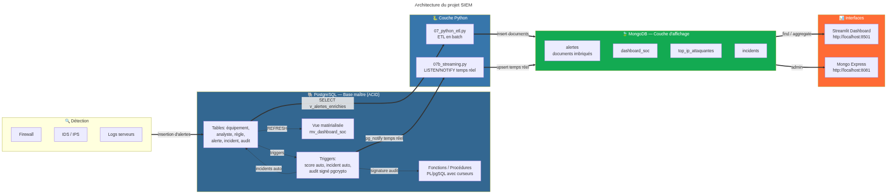
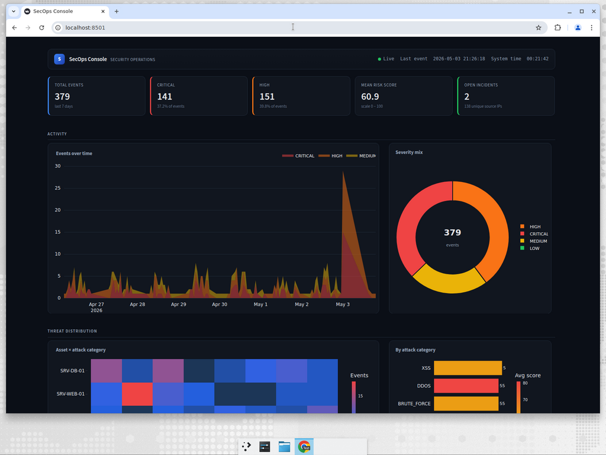
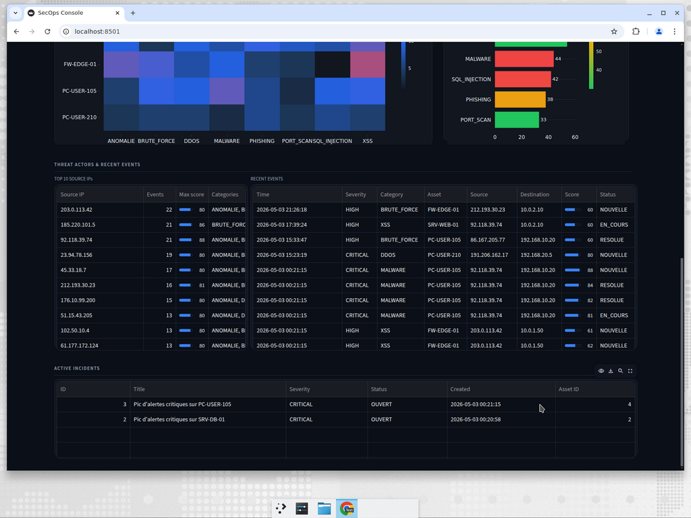

# PLSQL SIEM Database Showcase

> PostgreSQL/PLSQL and MongoDB academic SIEM project - schema design, triggers, stored procedures, ETL, streaming, and dashboard reporting.


This repository is a public showcase for my advanced database project. It documents a mini-SIEM platform while keeping the complete SQL, Python, JavaScript, and dashboard source private.

## What this is

The project models and analyzes security events such as IDS alerts, firewall logs, failed SSH attempts, SQL injection attempts, and malware signals.

Main ideas covered:

- PostgreSQL master schema with constraints, sequences, indexes, `INET`, `JSONB`, `pgcrypto`, and `pg_trgm`.
- PL/pgSQL functions, triggers, stored procedures, cursors, and materialized views.
- Audit integrity logic using chained hashes.
- PostgreSQL `LISTEN/NOTIFY` streaming pattern.
- MongoDB dashboard collections and aggregation queries.
- Python ETL and Streamlit/Plotly SOC dashboard.

## Architecture

```text
PostgreSQL
  schema, constraints, triggers, procedures, audit chain

Python ETL / Streaming
  batch sync plus LISTEN/NOTIFY event handling

MongoDB
  dashboard-oriented document model and aggregations

Streamlit Dashboard
  SOC-style analytics and visual reporting
```

## Public Snapshot

| Path | Purpose |
|---|---|
| `screenshots/architecture.png` | Architecture diagram |
| `screenshots/mcd.png` | Data model diagram |
| `screenshots/dashboard_*.png` | Dashboard captures |
| `code-snippets/alert-audit-pattern.sql` | Short illustrative PLSQL pattern |

## Screenshots / Diagrams

| Architecture | MCD |
|:--:|:--:|
|  |  |

| Dashboard Top | Dashboard Bottom |
|:--:|:--:|
|  |  |

## What is private

The complete `.sql`, `.py`, `.js`, Docker setup, Streamlit dashboard code, environment files, and generated archives are not published here. This keeps the academic source private while documenting the system design and results.

## Lessons Learned

1. SQL can model security context well when constraints and indexes are designed early.
2. `JSONB` is useful for variable alert payloads, but relational keys still matter for reporting.
3. Triggers and audit chains make integrity visible, but they must be kept simple and explainable.
4. MongoDB works well as a dashboard read model when fed from a normalized PostgreSQL source.
5. A database project is stronger when it includes both schema depth and operational visualization.

## License

Portfolio snapshot only - see [LICENSE](LICENSE). Full source code remains private.

## About Me

I am **Yassir Zahidi**, a Computer Engineering student focused on cybersecurity, databases, and practical academic projects.

- Portfolio: <https://y-zahidi.github.io>
- GitHub: <https://github.com/y-zahidi>

